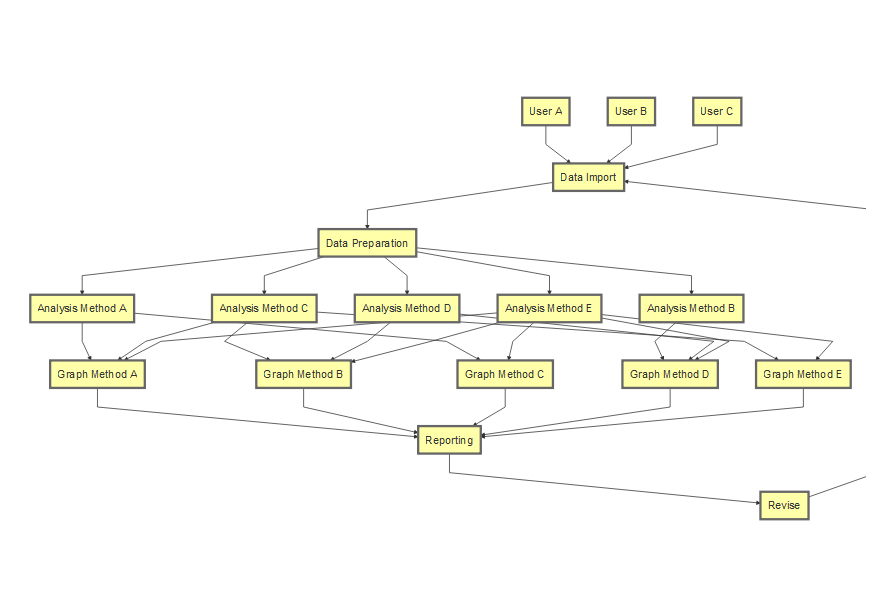

# Introductions

## Introductions 
```{r, echo=FALSE, eval=FALSE}
library(DiagrammeR)
mermaid("
graph TB
  UserA[User A]-->DataImport[Data Import]
  UserB[User B]-->DataImport
  UserC[User C]-->DataImport
  DataImport-->DataPreparation[Data Preparation]
  DataPreparation-->DataAnalysisA[Analysis Method A]
  DataPreparation-->DataAnalysisB[Analysis Method B]
  DataPreparation-->DataAnalysisC[Analysis Method C]
  DataPreparation-->DataAnalysisD[Analysis Method D]
  DataPreparation-->DataAnalysisE[Analysis Method E]
  DataAnalysisA-->GraphingMethodA[Graph Method A]
  DataAnalysisA-->GraphingMethodC[Graph Method C]
  DataAnalysisB-->GraphingMethodD[Graph Method D]
  DataAnalysisC-->GraphingMethodB[Graph Method B]
  DataAnalysisC-->GraphingMethodA
  DataAnalysisC-->GraphingMethodE[Graph Method E]
  DataAnalysisD-->GraphingMethodB
  DataAnalysisD-->GraphingMethodD
  DataAnalysisE-->GraphingMethodA
  DataAnalysisE-->GraphingMethodB
  DataAnalysisE-->GraphingMethodC
  DataAnalysisE-->GraphingMethodD
  DataAnalysisE-->GraphingMethodE
  GraphingMethodA-->Reporting
  GraphingMethodB-->Reporting
  GraphingMethodC-->Reporting
  GraphingMethodD-->Reporting
  GraphingMethodE-->Reporting
  Reporting-->Revise
  Revise-->DataImport
")
```    


## Introductions

- Name
- Expertise
- What do you intend to do with `R`?

## Let Me Tell You Why I Think You Should Use `R`

- Open Source
- Extensively Peer Reviewed (with caveats)
- Object Oriented
- Reproducibility Tools
- Bleeding Edge Methodologies
- Community

## Open Source

- Open source does _not_ mean "free"
- Code base freely available
- No trade secrets

## Extensively Peer Reviewed

- Related to Open Source
- Many eyes watching the work
- Especially true in `base` R and recommended packages (maintained by R Core)
- Generally true of most popular extension packages
- Tread carefully with lesser used packages

## Object Oriented

- Infinite variety of object 'classes'
- Analyses and results do not have to be contained in a one-size-fits-all format (ahem, SAS)
- "generic" methods

## Reproducibility Tools

R is a scripted language! 

>- This is one of R's biggest advantages
>- This is R's biggest barrier to entry

## Reproducibility Tools

- working directories
- projects (R Studio)
- R Markdown 

R markdown has almost no learning curve at all

## Bleeding Edge Methodologies

- A package exists for **everything**

What if I can't find a package that does my analysis?

>- Wait a couple months

What if I still can't find a package that does my analysis?

>- It's a novel idea: PUBLISH!

## Community

>- Collaborative
>- Non-competitive (mostly)
>- Scientifically valid and reproducible results are highly valued
>- Social Group _and_ Technical Network

## Essential Skills

- Data import
- Data cleaning
- Reshaping data
- Data visualization
- Reporting results
- Finding answers to questions
- Reproducible research
- `for` loops
- `apply` functions
- Gathering high quality data (not really an R topic, but will make your life so much easier)

## Advanced Skills

- Writing functions
- Writing packages
- Parallel computing
- Database interfacing

## Reproducible Research Demonstration

>- Initial Document.  
>-   Cool, right?

## Reproducible Research Demonstration

>- But would you want to publish that analysis in it's current appearance?
>- Let's clean it up a little?

## Reproducible Research Demonstration

>- Oh no!  We just came across new data!  Now we have to rewrite **everything**
>- Or just get the right data in and run it again.

