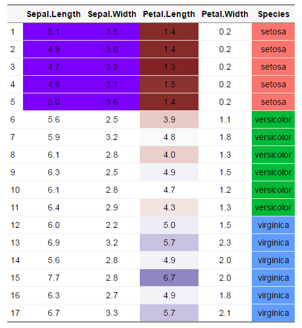

## Packages in this presentation
```{r, warning = FALSE, message = FALSE}
library(broom)
library(dplyr)
library(ggplot2)
library(magrittr)
library(reshape2)
library(tidyr)

library(knitr)
library(xtable)
library(pixiedust)
library(nnet)
options(pixiedust_print_method = "html")
```

## Table Construction: Guiding Principles

1. Avoid trying to use tables the way you would a graph.
2. If your table requires a legend, it’s too complicated. Use a graph instead.
3. Background colors should only be used for row or group discrimination (with very rare exceptions).
4. Subtlety is a virtue.
5. When using color (backgrounds, fonts, or borders), try to limit yourself to two colors.

## Table Construction: Core Concepts

1. Result Emphasis
2. Row Discrimination
3. Grouping
4. Sectioning

## Result Emphasis

* The concept of _subtly_ drawing attention to the result you want the reader to focus on.

* Please note the differnce between _subtlety_ and <font color = 'red' size = 20pt style = 'font-weight:bold;'><i>SUBTLETY</i></font>

## Result Emphasis

Your best options for drawing attention to results is to use either _italic_ or **bold**.  Don't use both.

```{r, echo = FALSE, warning = FALSE, message = FALSE}
StarWars <- read.csv("https://raw.githubusercontent.com/fivethirtyeight/data/master/star-wars-survey/StarWars.csv",
                     skip = 1, na = "") %>%
  setNames(c("id", "seen_any_film", "fan_of_franchise", "seen_1", 
             "seen_2", "seen_3", "seen_4", "seen_5", "seen_6", 
             "rank_1", "rank_2", "rank_3", "rank_4", "rank_5",
             "rank_6", "han_solo", "luke_skywalker", "leia_organa",
             "anakin_skywalker", "obi_wan", "palapatine", "vader",
             "lando", "fett", "c3po", "r2d2", "jarjar", 
             "amidala", "yoda", "shot_first", "expanded_univ",
             "expanded_univ_fan", "star_trek", "gender", "age",
             "income", "education", "location")) %>%
  mutate(age = factor(age, 
                      c("18-29", "30-44", "45-60", "> 60")))

result_attract <- 
  StarWars %>%
  select(fan_of_franchise, shot_first) %>%
  group_by(shot_first, fan_of_franchise) %>%
  summarise(freq = n()) %>%
  ungroup() %>%
  group_by(fan_of_franchise) %>%
  mutate(rel_freq = freq / sum(freq),
         value = sprintf("%s (%s)",
                         freq,
                         scales::percent(rel_freq))) %>%
  select(-freq, -rel_freq) %>%
  dcast(shot_first ~ fan_of_franchise, value.var = "value") %>%
  select(shot_first, No, Yes) %>%
  as.data.frame() 

result_attract %>%
  dust(caption = "Who Shot First by Self Declared Fan Status") %>%
  sprinkle_colnames(shot_first = "Who Shot First?") %>%
  sprinkle(pad = 3) %>%
  sprinkle(cols = "Yes",
           rows = 4,
           bold = TRUE) %>%
  medley_bw() %>%
  sprinkle_print_method("html")
```

## Result Emphasis 

```{r, echo = FALSE, warning = FALSE, message = FALSE}
result_attract %>%
  dust(caption = "Who Shot First by Self Declared Fan Status") %>%
  sprinkle_colnames(shot_first = "Who Shot First?") %>%
  sprinkle(pad = 3) %>%
  sprinkle(cols = "Yes",
           rows = 4,
           italic = TRUE) %>%
  medley_bw() %>%
  sprinkle_print_method("html")
```

## Result Emphasis

```{r, echo = FALSE, warning = FALSE, message = FALSE}
StarWars[["jarjar2"]] <- StarWars[["jarjar"]]
levels(StarWars[["jarjar2"]]) <- 
  list(Favorably = c("Very favorably", "Somewhat favorably"),
       Unfavorably = c("Very unfavorably", "Somewhat unfavorably"))
StarWars[["jarjar2"]] <- relevel(StarWars[["jarjar2"]], 
                                 ref = "Unfavorably")

fit <- 
  glm(jarjar2 ~ age + gender, 
      data = StarWars,
      family = binomial) 

fit_tab <- 
  dust(fit, 
     exponentiate = TRUE,
     descriptors = c("term_plain", "level_detail"),
     caption = "Logistic Regression for Perceiving Jar-Jar Binks Favorably") %>%
  medley_model() %>%
  sprinkle(cols = 1:2,
           rows = 1,
           replace = c("Intercept", "")) %>%
  sprinkle_colnames("Term", "Level", "Estimate", "SE", "Z", "P-value") %>%
  sprinkle(pad = 3)  %>%
  sprinkle_print_method("html")

fit_tab %>%
  sprinkle(rows = 5,
           bold = TRUE)
```

## Result Emphasis

```{r, echo = FALSE, warning = FALSE, message = FALSE}
fit_tab %>%
  sprinkle(rows = 2:4, 
           cols= 3,
           bold = TRUE)
```

## Result Emphasis (Violation of Subtlety Principle)

```{r, echo = FALSE, warning = FALSE, message = FALSE}
fit_tab %>%
  sprinkle(rows = 2:4,
           cols = "estimate",
           bg = "#DDDDDD")
```

## Result Emphasis (Violation of Subtlety Principle)

```{r, echo = FALSE, warning = FALSE, message = FALSE}
fit_tab %>%
  sprinkle(rows = 5, 
           font_color = "darkblue",
           font_size = 24)
```

## Result Emphasis (Violation of Subtlety Principle)

```{r, echo = FALSE, warning = FALSE, message = FALSE}
fit_tab %>%
  sprinkle(rows = 5, 
           font_color = "white",
           font_size = 24,
           bg = "red")
```

<b>This is like typing in all CAPS.  Don't do it.</b>

## Row Discrimination

Two common strategies

1. Background striping
2. Borders

## Row Discrimination

```{r, echo = FALSE, warning = FALSE, message = FALSE}
Sleep <- 
  read.csv("https://raw.githubusercontent.com/fivethirtyeight/data/master/sleeping-alone-data/sleeping-alone-data.csv", 
           skip = 2,
           header = FALSE,
           stringsAsFactors = FALSE) %>%
  setNames(c("start_date", "end_date", "relationship_status", 
             "relationship_duration", "sleep_separate",
             "where_sleep_separate", "where_sleep_separate_other",
             "where_sleep_separate_partner", 
             "where_sleep_separate_partner_other",
             "snores", "bathroom", "sick", "non_intimate", "temperature",
             "argument", "space", "blanket", "child", "schedule", 
             "other_reason", "first_time", "stay_together", 
             "sleep_better_separate", "sex_improve", "occupation", 
             "occupation_other", "gender", "age", "income", "education",
             "location")) 

Separate <- 
  Sleep %>%
  select(relationship_status, sleep_separate) %>%
  group_by(relationship_status, sleep_separate) %>%
  summarise(n_sleep_separate = n()) %>%
  ungroup() %>%
  dcast(sleep_separate ~ relationship_status,
        value.var = "n_sleep_separate") 
Separate %>%
  dust(caption = "Frequency of Sleeping Separate") %>%
  sprinkle(bg_pattern_by = "rows") %>%
  medley_bw() %>%
  sprinkle_print_method("html")
```


## Row Discrimination

```{r, echo = FALSE, warning = FALSE, message = FALSE}
Separate %>%
  dust(caption = "Frequency of Sleeping Separate") %>%
  medley_all_borders(vertical = FALSE) %>%
  medley_bw() %>%
  sprinkle_print_method("html")
```

## Grouping

```{r, echo = FALSE, warning = FALSE, message = FALSE}
library(RColorBrewer)
palette <- brewer.pal(9, "PRGn")

set.seed(13)
mtcars <- mtcars[sample(1:nrow(mtcars), nrow(mtcars)), ]

mtcars %>%
  dust(caption = "Vehicular Data Sorted by Gear with Background Toggling (not a good example)",
       label = "background-discriminate",
       keep_rownames = TRUE) %>%
  medley_bw() %>%
  sprinkle(logical_rows = quote(gear  == 3),
           bg = palette[2])  %>%
  sprinkle(logical_rows = quote(gear  == 4),
           bg = palette[5]) %>%
  sprinkle(logical_rows = quote(gear  == 5),
           bg = palette[8]) %>%
  sprinkle_print_method("html")
```

## Grouping

```{r, echo = FALSE, warning = FALSE, message = FALSE}
library(RColorBrewer)
palette <- brewer.pal(9, "PRGn")

set.seed(13)
mtcars <- 
  mtcars[sample(1:nrow(mtcars), nrow(mtcars)), ] %>%
  arrange(gear, mpg)

mtcars %>%
  dust(caption = "Vehicular Data Sorted by Gear and MPG with Background Toggling (still not ideal)",
       label = "background-discriminate",
       keep_rownames = TRUE) %>%
  medley_bw() %>%
  sprinkle(logical_rows = quote(gear  == 3),
           bg = palette[2])  %>%
  sprinkle(logical_rows = quote(gear  == 4),
           bg = palette[5]) %>%
  sprinkle(logical_rows = quote(gear  == 5),
           bg = palette[8]) %>%
  sprinkle_print_method("html")
```

## Grouping

```{r, echo = FALSE, warning = FALSE, message = FALSE}
mtcars %>%
  dust(caption = "Vehicular Data Sorted by Gear and MPG with Background Toggling",
       label = "toggle-background") %>%
  medley_bw() %>%
  sprinkle(logical_rows = quote(gear %in% c(3, 5)),
           bg = "#DDDDDD",
           border = "bottom",
           border_color = "white") %>%
  sprinkle(logical_rows = quote(!gear %in% c(3, 5)),
           bg = "white",
           border = "bottom",
           border_color = "#DDDDDD") %>%
  sprinkle_print_method("html")
```

```{r, echo = FALSE}
library(nnet)
StarWars[["jarjar"]] <- 
  factor(StarWars[["jarjar"]],
         levels = c("Neither favorably nor unfavorably (neutral)",
                    "Very unfavorably", "Somewhat unfavorably",
                    "Somewhat favorably", "Very favorably"))
fit <- 
  multinom(jarjar ~ age + gender, 
           data = StarWars) %>%
  tidy(exponentiate = TRUE) 

dust(fit, 
     caption = "Multinomial Logistic Regression for Jar-Jar Being Viewed Favorably") %>%
  medley_model() %>%
  sprinkle(logical_rows = quote(y.level %in% c("Very unfavorably", 
                                            "Somewhat favorably")),
           bg = "#DDDDDD",
           border = "bottom",
           border_color = "white") %>%
  sprinkle(logical_rows = quote(!y.level %in% c("Very unfavorably", 
                                                "Somewhat favorably")),
           bg = "white",
           border = "bottom",
           border_color = "#DDDDDD") %>%
  sprinkle_print_method("html")
```

## Sectioning

```{r, echo = FALSE, warning = FALSE, message = FALSE}
fit %>%
  group_by(y.level) %>%
  dust(fit, 
     caption = "Multinomial Logistic Regression for Jar-Jar Being Viewed Favorably",
     ungroup = FALSE) %>%
  medley_model() %>%
  sprinkle(bg_pattern_by = "rows") %>%
  sprinkle_print_method("html")
```

## Things to Avoid

Too much color

* It has recently become popular to use color to distinguish groups and gradients in tables the same we we may use them in graphs.
* Tables are inherently poorly designed for visualizing complex data

Compare:

```{r, echo = FALSE, message = FALSE, warning = FALSE}
dust(mtcars,
     caption = "gradient by Cylinder") %>%
  sprinkle(cols = "cyl", 
           discrete = "bg") %>%
  sprinkle_print_method("html")

ggplot(data = mtcars,
       mapping = aes(x = factor(cyl),
                     fill = factor(cyl))) + 
  geom_bar()
```

## Things to Avoid

Compare: 

```{r, echo = FALSE, message = FALSE, warning = FALSE}
mtcars %>%
  arrange(cyl, mpg) %>%
  dust(caption = "Vehicular Data Grouped by Gear and Sorted by MPG",
       label = "group-sort-shade") %>%
  medley_bw() %>%
  sprinkle(logical_rows = quote(cyl %in% c(4, 8)),
           bg = "#DDDDDD",
           border = "bottom",
           border_color = "white") %>%
  sprinkle(logical_rows = quote(!cyl %in% c(4, 8)),
           bg = "white",
           border = "bottom",
           border_color = "#DDDDDD") %>%
  sprinkle(cols = "mpg",
           gradient = "bg",
           gradient_color = palette[c(2, 8)]) %>%
  sprinkle_print_method("html")

ggplot(data = mtcars,
       mapping = aes(x = factor(cyl),
                     y = mpg)) + 
  geom_boxplot()
```

# Table Generating Packages and Functions

## `knitr::kable`

* Basic tables that adapt to Markdown, HTML, or LaTeX output based on your document type.
* Very little in the way of customization (by design)
* Generally adequate for most tables unless you require some customization

```{r, echo = FALSE}
fit <- 
  glm(jarjar2 ~ age + gender, 
      data = StarWars,
      family = binomial) 
```

```{r}
tidy(fit) %>%
  knitr::kable()
```

## `xtable` package

* Widely accepted as the standard for table generation.
* works with many object types
* Can produce HTML and LaTeX, but not markdown
* Extremely flexible, but requires knowledge of HTML and/or LaTeX
* If you use customizations, you are limited to either HTML _or_ LaTeX. 
* Does not inherently change output type based on your document

```{r, results = 'asis'}
tidy(fit) %>%
  xtable() %>%
  print(type = "html")
```

## `pixiedust` (My personal favorite)

* Transitions between markdown, HTML, and LaTeX output based on your document type.
* Similar flexibility as `xtable`, but not quite as flexible.  Covers just about everything that is used on a regular basis
* Applies `tidy` for you
* Preserves the values of the original data
* Verbose


```{r, results = 'asis'}
dust(fit) %>%
  medley_model() %>%
  sprinkle_print_method("html") # not normally necessary
```

## `htmlTable` 

* Only does HTML Output
* Probably the most flexible and widely used package for HTML Output

```{r, results = 'asis'}
library(htmlTable)
tidy(fit) %>%
  htmlTable()
```

## `condformat`

* Specializes in conditional formatting (colored background cells)
* Produces HTML, LaTeX, and Excel output
* Overloads the `+` operator (much like `ggplot`) which has become a less-favored practice
* Some versions require `rJava`, which requires Java on your machine, which can be a pain to manage.

```{r, eval = FALSE}
library(condformat)
data(iris)
library(condformat)
condformat(iris[c(1:5,70:75, 120:125),]) +
  rule_fill_discrete(Species) + 
  rule_fill_discrete(Sepal.Width, Sepal.Length,
                     expression = Sepal.Width > Sepal.Length - 2.25,
                     colours = c("TRUE" = "#7D00FF")) + 
  rule_fill_gradient2(Petal.Length)
```

